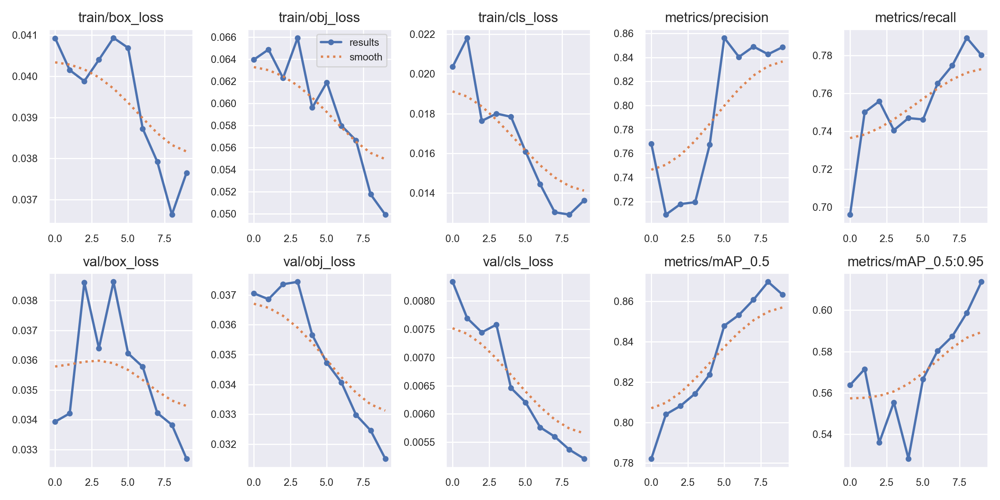
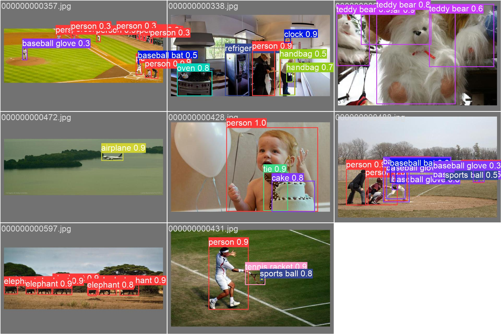
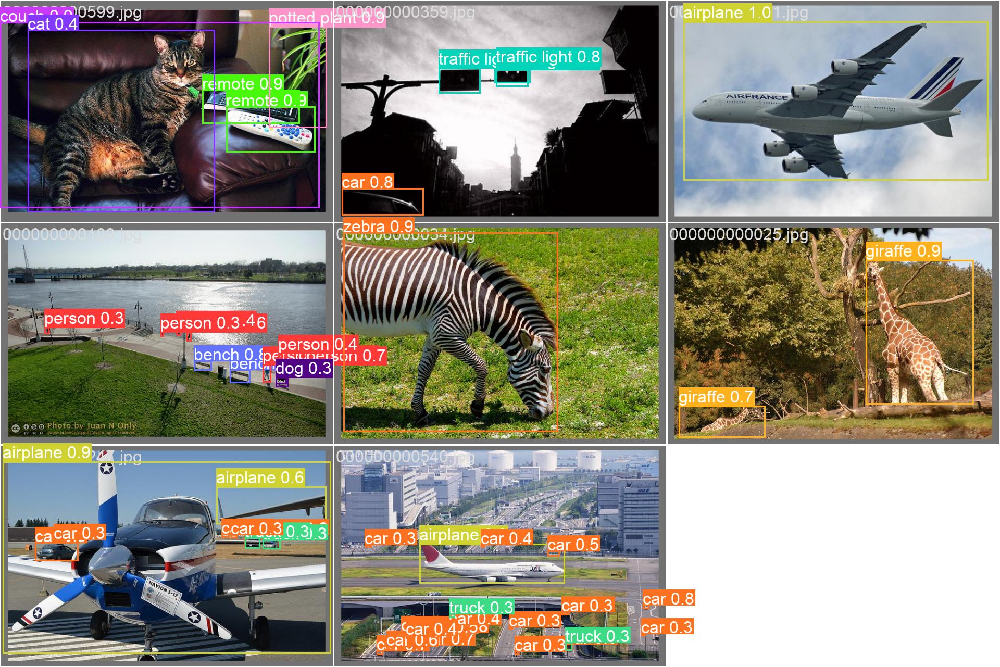
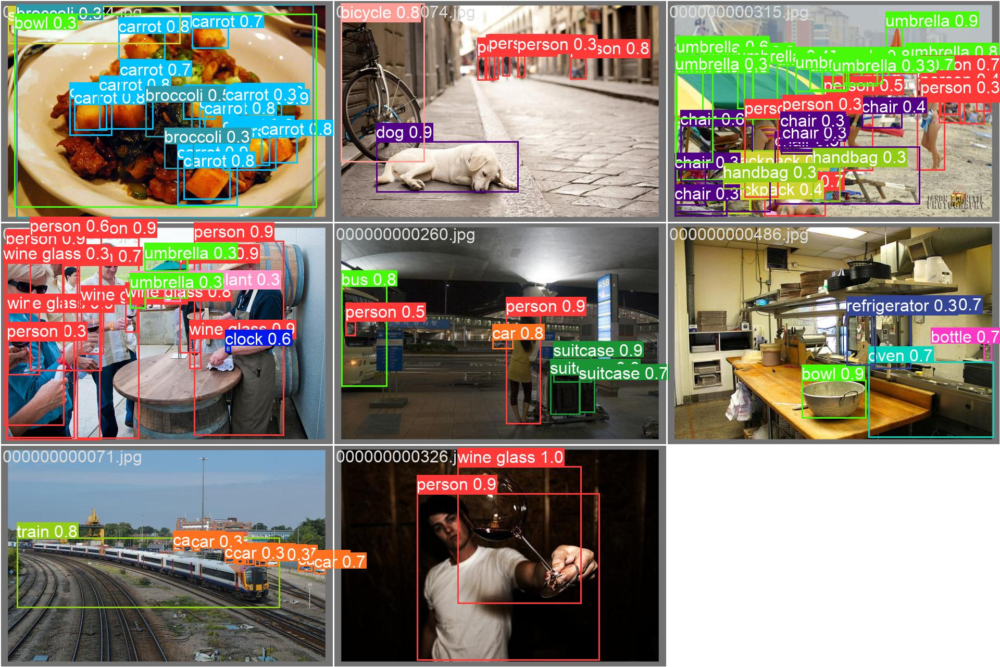

# Task-12. Practise YOLOv5 - Image Detection
Link: [Task-12-Yolov5-Image-Detection.ipynb](https://github.com/helios12/DataScienceProjects/blob/main/tasks/task-12/Task-12-Yolov5-Image-Detection.ipynb)

The goal of the task is to learn the YOLO techniques. In the first part of the task I prepared annotations in the YOLO format, trained a YOLO model and performed inference. In the second part of the task the goal is to use a more standardized `train.py` file provided by ultralytics, train up-to at least mAP=0.85 and present the visual results using the bboxes.

## Technology Stack
While working on this task I have mastered:

* python
* YOLOv5
* Matplotlib

## Conclusions
I was able to train both YOLOv5 models - a custom one and using the `train.py`. In the latter case the mAP value of 0.87 has been reached assuring confident detection levels.
A side effect of this task was that I found out that Apple MPS has a very poor support of the YOLO models. The results on the MPS device compared to the CPU were around 30 % lower under other equal conditions.

## Figures

Metrics for training and validation

Image 1 with bboxes and class labels

Image 2 with bboxes and class labels

Image 3 with bboxes and class labels

